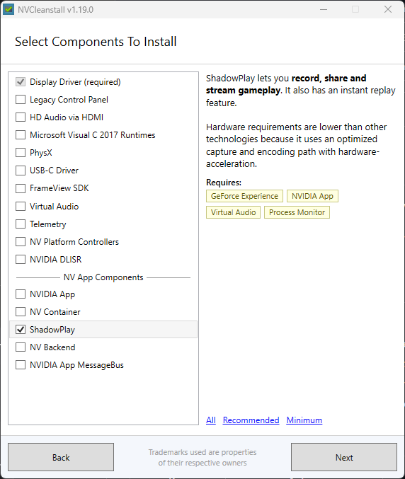

# Standalone ShadowPlay

Use NVIDIA ShadowPlay's instant replay and clipping without the NVIDIA App or its overlay.

Same hardware-accelerated capture (NvFBC + NVENC), same game detection, same clip quality — just without the bloat.

## What you get

- **169 KB tray app** — zero CPU when idle
- **Instant replay** — saves the last N seconds on hotkey
- **Per-game clip folders** — Deadlock, Overwatch, etc.
- **No NVIDIA App, no overlay, no CEF, no telemetry**
- **Anticheat safe** — only NVIDIA-signed binaries touch game processes

## Hotkeys

| Key | Action |
|-----|--------|
| `Alt+F10` | Save instant replay |
| `Alt+F9` | Toggle manual recording |
| `Alt+Shift+F10` | Toggle instant replay on/off |

Right-click the tray icon for menu + settings.

## Install

### Requirements

- NVIDIA GPU
- NVIDIA display driver installed via [NVCleanstall](https://www.techpowerup.com/download/techpowerup-nvcleanstall/) with **ShadowPlay** checked:



### Steps

1. [**Download ZIP**](https://github.com/v0ot/Standalone-Shadowplay/archive/refs/heads/master.zip) and extract it
2. Right-click **`install.bat`** → **Run as administrator**
3. Run **`bin\ShadowPlay.exe`**

Done.

### Uninstall

```
install.bat /uninstall
```

## Settings

Double-click the tray icon or right-click → Settings:

- **Resolution** — capture width/height
- **FPS** — 1–120
- **Buffer length** — instant replay duration in seconds
- **Encoder profile** — Base / Main / High
- **Microphone** — on/off (toggles mic in clips only, stays live for Discord)

## FAQ

**Do I need the NVIDIA App?**
No. That's the whole point.

**Do I need ShadowPlay checked in NVCleanstall?**
Yes — it installs the driver-level capture infrastructure (nvspcap64.dll, NvContainer service). The overlay and app are replaced by this project.

**Does this work with Vanguard / EAC / BattlEye?**
Yes. The D3D hook (nvspcap64.dll) is NVIDIA-signed and whitelisted by all major anticheats.

**What about audio?**
System audio is captured automatically. Mic can be toggled via the tray menu.

**What about stretch resolution?**
Handled automatically — NvFBC captures at the GPU output level.
